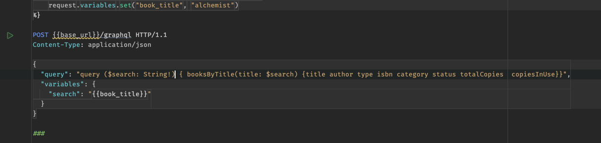

# INSTRUCTION NOTES

## To execute this project on localhost, please execute the following command: 

```bash 
   docker compose up -d 
```

## How to test the request

This application uses GraphQL. Once you start it through
the command above, you can use the
[.http file requests](Books.Api/BookApi.http) inside the solution.
Ensure you have an HTTP client installed in your ide,
then click on the play button.



If you want to apply a filter by title, author name, or category,
add the value in the respective variable.
Just update the value of one of those variables like below:

```yaml 
  request.variables.set("book_title", "alchemist") or
  request.variables.set("book_title", "") //To get all records
   
```
